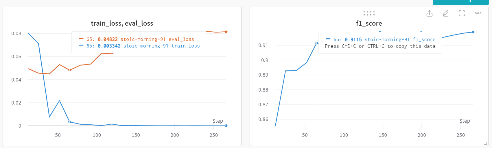
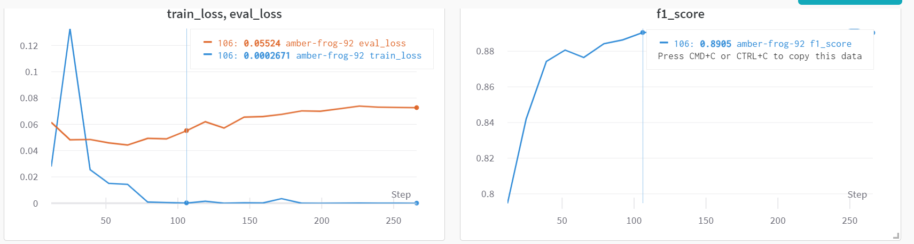

# Named-Entity Recognition for Slovenian, Croatian and Serbian

An evaluation of various encoder Transformer-based large language models on the named entity recognition task. The models are compared on 6 datasets, manually-annotated with named entitites:
 - standard Slovene (separated into 3 datasets)
 - non-standard Slovene
 - standard Croatian
 - non-standard Croatian
 - standard Serbian
 - non-standard Serbian

## Dataset preparation

To download the datasets from the CLARIN.SI repository and prepare JSON files which will be used as train, dev and test files for classification with the simpletransformers library, run the following command in the command line:

```
bash prepare_datasets.sh "s_Slovene" "ns_Slovene" "s_Croatian" "ns_Croatian" "s_Serbian" "ns_Serbian" > dataset_preparation.log
```

You can use all available datasets or define just a couple of them as the arguments (e.g., if you want to download only standard and non-standard Serbian: "s_Serbian" "ns_Serbian" )

Extracted JSON files are dictionaries which consist of the following keys:
 - "labels" (list of NE labels used in the dataset)
 - "train", "dev", "test" (dataset splits - in case of Croatian and Serbian datasets)
 - "dataset" (in case of Slovenian datasets which are not separated into splits)

"train", "dev", "test" and "dataset" are also dictionaries, with the following keys:
 - "sentence_id" (original sentence id)
 - "words" (word forms)
 - "labels" (NE labels)

To use them for classification with the simpletransformers library:
```
import json
import pandas as pd

# Define the path to the dataset
dataset_path = "datasets/set.sr.plus.conllup_extracted.json"

# Load the json file
with open(dataset_path, "r") as file:
    json_dict = json.load(file)

# Open the train, eval and test dictionaries as DataFrames
train_df = pd.DataFrame(json_dict["train"])
test_df = pd.DataFrame(json_dict["test"])
dev_df = pd.DataFrame(json_dict["dev"])

```

## Hyperparameter search

### Hyperparameter search for XLM-R-Large

Code (change in the code the number of epochs you want to run - line 53 - and whether the xlm-r model is base or large - line 87):
```
CUDA_VISIBLE_DEVICES=1 nohup python hyperparameter_search.py > search_hr_base_epochs20.txt &
```

I performed it on standard HR dataset (hr500k).

I searched for the optimum no. of epochs, while we set the other hyperparameters to these values:

```
model_args ={"overwrite_output_dir": True,
             "labels_list": LABELS,
             "learning_rate": 1e-5,
             "train_batch_size": 32,
             "no_cache": True,
             "no_save": True,
             "max_seq_length": 256,
             "save_steps": -1,
            # Use these parameters if you want to evaluate during training
            "evaluate_during_training": True,
            ## Calculate how many steps will each epoch have
            # num steps in epoch = training samples / batch size
            # Then evaluate after every 3rd epoch
            "evaluate_during_training_steps": len(train_df.words)/32*3,
            "evaluate_during_training_verbose": True,
            "use_cached_eval_features": True,
            'reprocess_input_data': True,
}
```

I searched for the optimum no. of epochs by training the model for 20 epochs and then evaluating during training. Then I inspected how the evaluation loss falls during training and did a more fine-grained evaluation by training the model again on a couple of most promising epochs.

Based on the training loss, evaluation loss and f1 score, the optimum no. of epochs is *7* for large models and *8* for base models (afterwards, f1 plateaus and evaluation loss rises).

Hyperparameter search for XLM-R-large:



Hyperparameter search for XLM-R-base:



### Hyperparameters used for XLM-R-large models

```
model_args ={"overwrite_output_dir": True,
             "num_train_epochs": 7,
             "labels_list": LABELS,
             "learning_rate": 1e-5,
             "train_batch_size": 32,
             # Comment out no_cache and no_save if you want to save the model
             "no_cache": True,
             "no_save": True,
             "max_seq_length": 256,
             "save_steps": -1,
            "wandb_project": "NER",
            "silent": True,
             }
```

### Hyperparameters used for XLM-R-base models

Including SloBERTa, BERTić, CSEBERT.

```
model_args ={"overwrite_output_dir": True,
             "num_train_epochs": 8,
             "labels_list": LABELS,
             "learning_rate": 1e-5,
             "train_batch_size": 32,
             # Comment out no_cache and no_save if you want to save the model
             "no_cache": True,
             "no_save": True,
             "max_seq_length": 256,
             "save_steps": -1,
            "wandb_project": "NER",
            "silent": True,
             }
```

## Model evaluation

For each dataset, run the following code (with the path to the extracted dataset in json as the argument):

```
CUDA_VISIBLE_DEVICES=1 nohup python ner-classification.py datasets/hr500k.conllup_extracted.json > ner_classification.log &
```