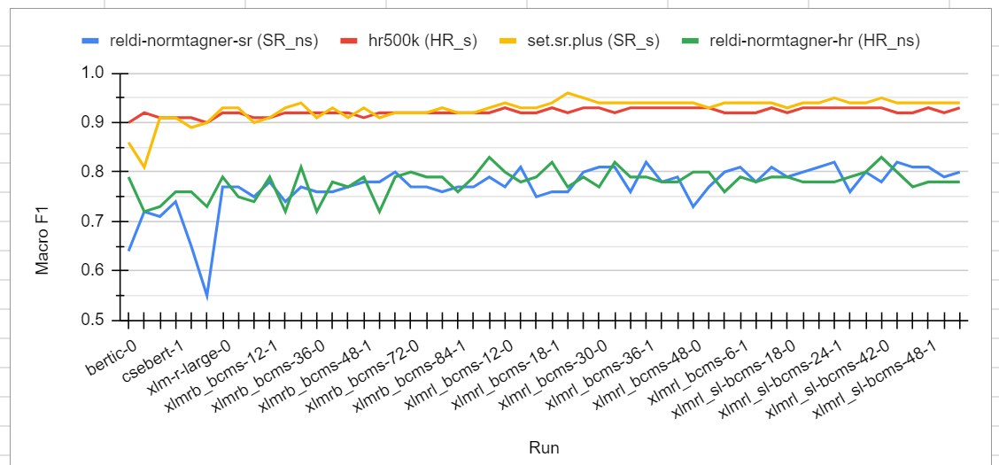
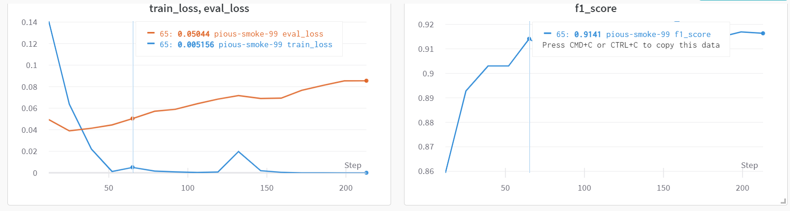
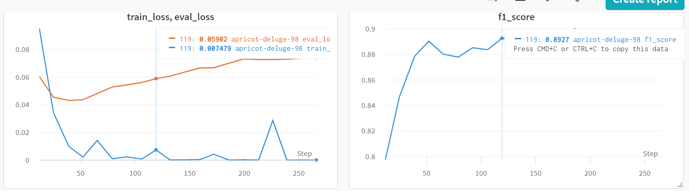
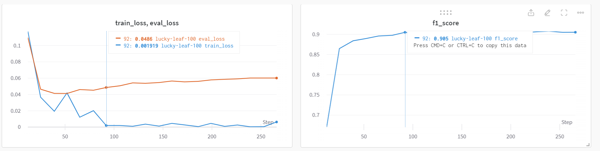
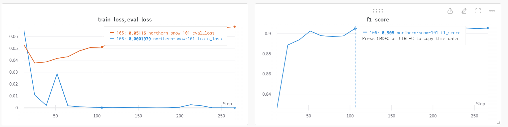
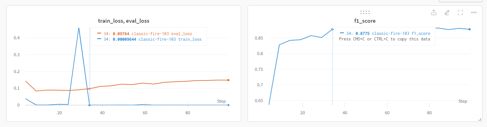
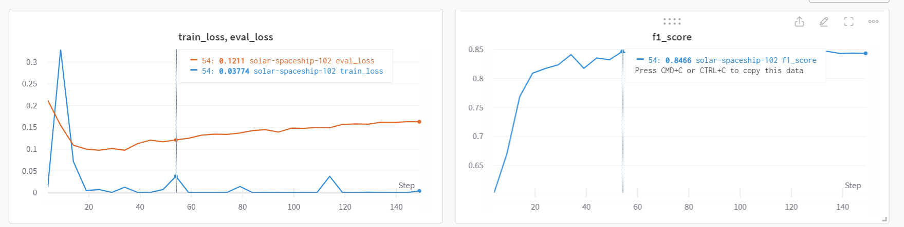
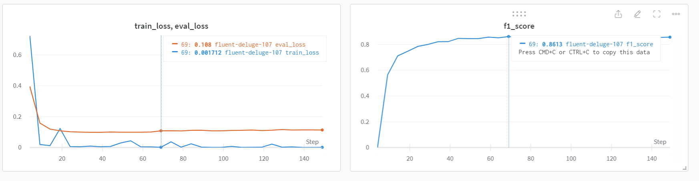
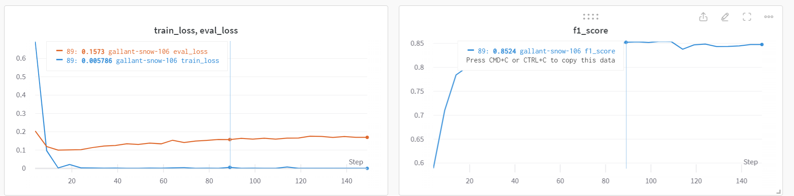

# Named-Entity Recognition for Slovenian, Croatian and Serbian

An evaluation of various encoder Transformer-based large language models on the named entity recognition task. The models are compared on 6 datasets, manually-annotated with named entitites:
 - standard Slovene (separated into 3 datasets)
 - non-standard Slovene
 - standard Croatian
 - non-standard Croatian
 - standard Serbian
 - non-standard Serbian

**Dataset sizes**

(Sizes in no. of words - instances)

| elexiswsd (SL_s) | /senticoref (SL_s) | hr500k (HR_s) | reldi-normtagner-hr (HR_ns) | reldi-normtagner-sr (SR_ns) | set.sr.plus (SR_s) | ssj500k (SL_s) | Janes-Tag (SL_ns) |
|------------------|--------------------|---------------|-----------------------------|-----------------------------|--------------------|----------------|-------------------|
| 31,233           | 391,962            | 499,635       | 89,855                      | 97,673                      | 92,271             | 235,864        | 75,926            |

## Results



**Base-sized models**

(Each model was trained and tested twice, these results are the means of two runs.)

| Base-sized Model | hr500k-Macro F1 | hr500k-Std | reldi-hr-Macro F1 | reldi-hr-Std | reldi-sr-Macro F1 | reldi-sr-Std | set.sr-Macro F1 | set.sr-Std |
|------------------|-----------------|------------|-------------------|--------------|-------------------|--------------|-----------------|------------|
| bertic           | 0.91            | 0.01       | 0.75              | 0.05         | 0.68              | 0.06         | 0.83            | 0.04       |
| csebert          | 0.91            | 0.00       | 0.75              | 0.02         | 0.73              | 0.02         | 0.91            | 0.00       |
| xlm-r-base       | 0.91            | 0.00       | 0.75              | 0.02         | 0.60              | 0.07         | 0.90            | 0.00       |
| xlmrb_bcms-12    | 0.91            | 0.00       | 0.77              | 0.04         | 0.76              | 0.02         | 0.91            | 0.00       |
| xlmrb_bcms-96    | 0.92            | 0.00       | 0.81              | 0.03         | 0.78              | 0.01         | 0.93            | 0.00       |

In the case of Croatian and Serbian non-standard, the first step of our model (XLM-R-b-BCMS-12k) already improves the results. The last step (96k) improves the results on all datasets (for 0.01 to 0.18 points). More steps improves results (96k gives better results than 12k).

**Large-sized models**

(Each model was trained and tested twice, these results are the means of two runs.)

| Large-sized Model | hr500k-Macro F1 | hr500k-Std | reldi-hr-Macro F1 | reldi-hr-Std | reldi-sr-Macro F1 | reldi-sr-Std | set.sr-Macro F1 | set.sr-Std |
|-------------------|-----------------|------------|-------------------|--------------|-------------------|--------------|-----------------|------------|
| xlm-r-large       |            0.92 |       0.00 |              0.77 |         0.03 |              0.77 |         0.00 |            0.93 |       0.00 |
| xlmrl_bcms-6      |            0.92 |       0.00 |              0.77 |         0.02 |              0.81 |         0.01 |            0.94 |       0.00 |
| xlmrl_bcms-48     |            0.93 |       0.00 |              0.80 |         0.00 |              0.75 |         0.03 |            0.93 |       0.01 |
| xlmrl_sl-bcms-6   |            0.92 |       0.00 |              0.78 |         0.00 |              0.80 |         0.01 |            0.94 |       0.00 |
| xlmrl_sl-bcms-48  |            0.93 |       0.01 |              0.77 |         0.01 |              0.81 |         0.00 |            0.94 |       0.00 |

When compared with XLM-R-large, our models improve the results on all datasets (from 0.01 to 0.04 points).
There are no big differences between XLM-R-BCMS and XLM-R-SI-BCMS.
There are also no obvious indications that 48k steps is better than 6k steps - already 6k steps is enough in most cases.

## Dataset preparation

To download the datasets from the CLARIN.SI repository and prepare JSON files which will be used as train, dev and test files for classification with the simpletransformers library, run the following command in the command line:

```
bash prepare_datasets.sh "s_Slovene" "ns_Slovene" "s_Croatian" "ns_Croatian" "s_Serbian" "ns_Serbian" > dataset_preparation.log
```

You can use all available datasets or define just a couple of them as the arguments (e.g., if you want to download only standard and non-standard Serbian: "s_Serbian" "ns_Serbian" )

Extracted JSON files are dictionaries which consist of the following keys:
 - "labels" (list of NE labels used in the dataset)
 - "train", "dev", "test" (dataset splits)

"train", "dev", "test" and "dataset" are also dictionaries, with the following keys:
 - "sentence_id" (original sentence id)
 - "words" (word forms)
 - "labels" (NE labels)

Croatian and Serbian datasets already have information on splits, so we split them according to the original splits. The Slovenian datasets are originally not split into train, dev and test subset - we split them in 80:10:10 train-dev-test ratio according to doc ids (we extract doc ids and randomly split them into train-dev-test). The Slovenian Elexis WSD dataset does not have doc ids (and sentences are not connected), so we split them according to sentence ids.

To use them for classification with the simpletransformers library:
```
import json
import pandas as pd

# Define the path to the dataset
dataset_path = "datasets/set.sr.plus.conllup_extracted.json"

# Load the json file
with open(dataset_path, "r") as file:
    json_dict = json.load(file)

# Open the train, eval and test dictionaries as DataFrames
train_df = pd.DataFrame(json_dict["train"])
test_df = pd.DataFrame(json_dict["test"])
dev_df = pd.DataFrame(json_dict["dev"])

# Change the sentence_ids to integers (!! important - otherwise, the models do not work)
test_df['sentence_id'] = pd.factorize(test_df['sentence_id'])[0]
train_df['sentence_id'] = pd.factorize(train_df['sentence_id'])[0]
dev_df['sentence_id'] = pd.factorize(dev_df['sentence_id'])[0]

# Define the labels
LABELS = json_dict["labels"]
print(LABELS)

print(train_df.shape, test_df.shape, dev_df.shape)
print(train_df.head())

```

## Hyperparameter search

We did hyperparameter search for the following models:
- XLM-R-base - hyperparameters to be used for XLM-R-b-BCMS models as well
- XLM-R-large - - hyperparameters to be used for XLM-R-l-BCMS and XLM-R-l-SL-BCMS models as well
- BERTić
- CSEBERT

For each model, we do 3 searches:
- one on hr500k: to be used for hr500k
- one on reldi-hr: to be used for reldi-hr, reldi-sr
- one on set.sr: to be used for set.sr

(For later experiments on SL data, we will do separate hyperparameter searches for these models and SloBERTa on ssj500k and Janes-Tag.)

I searched for the optimum no. of epochs, while we set the other hyperparameters to these values:

```
model_args ={"overwrite_output_dir": True,
             "labels_list": LABELS,
             "learning_rate": 1e-5,
             "train_batch_size": 32,
             "no_cache": True,
             "no_save": True,
             "max_seq_length": 256,
             "save_steps": -1,
            # Use these parameters if you want to evaluate during training
            "evaluate_during_training": True,
            ## Calculate how many steps will each epoch have
            # num steps in epoch = training samples / batch size
            # Then evaluate after every 3rd epoch
            "evaluate_during_training_steps": len(train_df.words)/32*3,
            "evaluate_during_training_verbose": True,
            "use_cached_eval_features": True,
            'reprocess_input_data': True,
}
```

Code: ``` CUDA_VISIBLE_DEVICES=1 nohup python hyperparameter_search.py -d datasets/hr500k.conllup_extracted.json -ln xlm-r-base -e 20 > logs/search_hr_base_epochs20.txt & ```

Args:
- ln: xlm-r-base, xlm-r-large, csebert or bertic
- d (dataset on which we run hyperparameter search): datasets/hr500k.conllup_extracted.json or datasets/reldi-normtagner-hr.conllup_extracted.json
- e: number of epochs to fine-tune the model for, e.g. 20

### Hyperparameter search on hr500k

I searched for the optimum no. of epochs by training the model for 20 epochs and then evaluating during training. Then I inspected how the evaluation loss falls during training (when F1 plateaus and evaluation loss starts rising).

Hyperparameter search for XLM-R-large:



Hyperparameter search for XLM-R-base:



Hyperparameter search for BERTić:



Hyperparameter search for CSEBERT:



### Hyperparameter search on reldi-hr

Hyperparameter search for XLM-R-large:



Hyperparameter search for XLM-R-base:



Hyperparameter search for BERTić:



Hyperparameter search for CSEBERT:



### Hyperparameters used 

We use the following hyperparameters for all models and change only the no. of epochs (`num_train_epochs`):

```
model_args ={"overwrite_output_dir": True,
             "labels_list": LABELS,
             "learning_rate": 1e-5,
             "train_batch_size": 32,
             # Comment out no_cache and no_save if you want to save the model
             "no_cache": True,
             "no_save": True,
             "max_seq_length": 256,
             "save_steps": -1,
            "silent": True,
             }
```

Number of epochs for hr500k:
- XLM-R-large, XLM-R-l-BCMS, XLM-R-l-SI-BCMS: 5
- XLM-R-base, XLM-R-b-BCMS: 9
- BERTić: 7
- CSEBERT: 8

Number of epochs for set.sr:
- XLM-R-large, XLM-R-l-BCMS, XLM-R-l-SI-BCMS: 11
- XLM-R-base, XLM-R-b-BCMS: 11
- BERTić: 12
- CSEBERT: 9

Number of epochs for reldi-hr and reldi-sr:
- XLM-R-large, XLM-R-l-BCMS, XLM-R-l-SI-BCMS: 7
- XLM-R-base, XLM-R-b-BCMS: 11
- BERTić: 14
- CSEBERT: 9


## Model evaluation

For each dataset, run the following code (with the path to the extracted dataset in json as the argument) for the publicly available datasets:

```
CUDA_VISIBLE_DEVICES=1 nohup python ner-classification.py datasets/hr500k.conllup_extracted.json > ner_classification.log &
```

For our own models, run the following code:
```
CUDA_VISIBLE_DEVICES=2 nohup python ner-classification-with-custom-models.py datasets/reldi-normtagner-hr.conllup_extracted.json > ner_classification_custom.log &
```

The outputs are saved as:
- *ner-results.txt* and *ner-results-our-models.txt*: files with all results from all runs (including per label results)
- *ner-results-summary-table.csv* and *ner-results-summary-table-our-models.csv*: tables with summarized results (just Macro F1s for each dataset for each model)
- *datasets/hr500k.conllup_extracted.json-test_df-with-predictions.csv* (dataset path + -test_df-with-predictions.csv): test splits with y_pred values from all runs
- confusion matrices are saved in the *figures/cm-datasets* folder